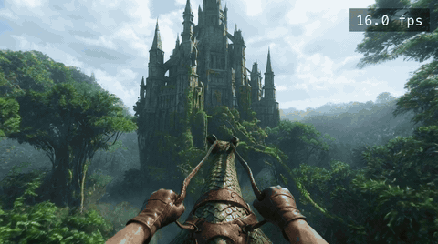

# LingBot-World realtime

Write-up with the videos: [kaarelkaarelson.com/lingbot](https://kaarelkaarelson.com/lingbot/)

Real-time [LingBot-World 2.0](https://github.com/Robbyant/lingbot-world-v2) (1.3B `causal_fast`) on one RTX 5090: **17 FPS as played** at 832×464 (16.9–17.0 measured on a stock pod), up from 5.5 FPS with the stock code, with the original Wan 2.1 decoder and no change to the model. Real time is 16 FPS.



`lingbot play dragon`, 4 s of the 22 s clip at native 832×464 (the GIF plays at 12 fps; the counter is the real per-chunk generation rate, 16 frames ÷ that chunk's DiT + VAE time). Full clip: [dragon_16fps.mp4](https://github.com/kaarelkaarelson/lingbot-world-realtime/releases/download/v0.2.0/dragon_16fps.mp4) (22 MB).

Other engines that run this checkpoint, measured out of the box on the same card at the same settings (832×464, 4 steps, 16-frame chunks, Wan VAE; steady state after warm-up, one run each):

| Engine | s per chunk | FPS as played | Ours vs it | What it ran on the 5090 |
|---|---|---|---|---|
| **Ours** | 0.98 | **16.1** | — | FP8 GEMMs, SageAttention, fused + compiled DiT, fused fp16 VAE |
| SGLang Diffusion v0.5.17 | 2.48 | 6.45 | **2.5×** | torch SDPA, bf16 eager, fp32 VAE |
| NVIDIA FlashDreams `c1889e0` | 1.85 | 8.65 | **1.9×** | bf16 cuDNN SDPA, its compile + CUDA graphs; window 20/6, static camera |
| LightX2V `69018c9` | 2.07 | 7.73 | **2.1×** | torch SDPA, bf16 DiT and VAE, eager |
| Original paper's code, single GPU | 2.68 | 6.0 | **2.7×** | bf16 FlashAttention-2 eager, fp32 VAE |

Every engine was run as it ships; nothing of ours was added to another engine. Speedup is FPS as played, ours ÷ theirs.

Scripts, deviations and raw logs: [`bench/engines/`](bench/engines/README.md), with one clip played at each engine's cadence.

This is the upstream repository at commit `1895d30` plus a set of inference patches, applied in-tree, with one command to run it. Everything here was measured on a RunPod RTX 5090 (32 GB); the measurements, the profiles and the quality checks live in [lingbot-world-v2-stream](https://github.com/kaarelkaarelson/lingbot-world-v2-stream).

| Configuration | DiT + VAE, s per 1 s chunk | FPS as played |
|---|---|---|
| Stock repo, fp32 Wan VAE | 2.87 + 1.05 = 3.9 | 5.7 |
| `--preset exact` (DiT bit-identical to stock bf16) | 0.73 + 0.34 = 1.07 | 14.8 |
| **`--preset fast` (default)** | **0.62 + 0.33 = 0.95** | **16.9–17.0** |

"As played" is what a streaming loop pays per second of video: four denoising steps plus the decode of 16 frames. The denoise loop alone runs at 25 FPS.

## Quick start

One RTX 5090 (32 GB), Linux x86_64 or Windows via WSL2 (untested — reports welcome), NVIDIA driver ≥ 570, a Hugging Face token for the weights.

```bash
git clone https://github.com/kaarelkaarelson/lingbot-world-realtime
cd lingbot-world-realtime
HF_TOKEN=hf_... ./setup.sh     # ~15 min once: Python 3.12, torch, prebuilt kernels, 18 GB of weights, compile warm-up
. .venv/bin/activate
lingbot play                   # ~35 s of warm-up, then a window on the world at 16 FPS
```

`lingbot play wall` picks another scene — each is an image + prompt + camera intrinsics from upstream's examples: `lake` (default), `wall` (Great Wall), `stonehenge`, `alley` (game-engine city), `castle` and `dragon` (dragon rider over a jungle). Your own world: `lingbot play --image me.jpg --prompt "one sentence describing the scene"`.

| Key | Action |
|---|---|
| `W` `A` `S` `D` | move (hold `Shift` to run) |
| `Q` `E` | down / up |
| `←` `→` `↑` `↓` | look (45°/s); mouse drag also looks |
| `R` | restart the world from the image |
| `Esc` | quit |

Measured on a stock RunPod RTX 5090 (2026-09-17): `lingbot bench` 16.9–17.0 FPS as played, `lingbot play` 16.9 FPS with key→pixel 1.58 s p50 (the window shows it live). Nothing leaves the machine: no browser, no network, no codec.

```bash
lingbot bench                                                       # 22 s clip -> outputs/, prints s/chunk and FPS as played
lingbot clip --image me.jpg --action_path my_poses/ --prompt "…"    # offline generation, any generate.py flag
lingbot play stonehenge --input-mode hold                           # a scene by name; hold-mode input
```

## Details

- `setup.sh` fetches Python 3.12 through `uv` if the system lacks it; the torch wheels carry their own CUDA runtime, so the host needs only the driver. The weights (`robbyant/lingbot-world-v2-1.3b-causal-fast` + the Wan VAE and T5 from the 14B release) come from Hugging Face with your token and are not redistributed here.
- First `play` after `setup.sh`: ~35 s of warm-up (compiled graphs from `.inductor_cache/`); on a cold cache ~2.5 min. Each new prompt is T5-encoded once (~30 s) and cached. Any image works (it is resized to the 480×832 pixel budget keeping its aspect ratio); the first image with a new aspect ratio compiles once more (~2.5 min).
- The HUD (window title and terminal, once a second): FPS shown, seconds per chunk (a chunk = 16 frames = 1 s of video), key→pixel = keydown to the first shown frame of the latent it landed in. `--input-mode hold`: held keys act from the next chunk's first frame, releases overshoot by up to one chunk; the default `history` replays each key edge into the latent it was made in. `--frame_num` sets the rollout length (default 361 frames; the world restarts from the image after it).
- `lingbot bench` / `lingbot clip` are `generate.py` with `run.sh`'s defaults (`./run.sh` still works). `my_poses/` = `poses.npy` (one OpenCV camera-to-world 4×4 per output frame) + `intrinsics.npy`, as in `examples/*/`.
- No display (a cloud pod): `SDL_VIDEODRIVER=dummy lingbot play --headless-seconds 120` runs the real model without a window, taps `W` every 2.5 s and prints the HUD and a summary (warm-up, s/chunk, FPS, key→pixel, underruns).
- Native Windows is not supported (the prebuilt kernels are Linux wheels).

## Presets

| `--preset` | What runs | Numerics vs stock |
|---|---|---|
| `fast` (default) | torch.compile + coordinate-descent tuning, fused DiT elementwise, sync-free loop, compensated-fp32 RoPE, FP8 rowwise linears, SageAttention (INT8 QK / FP8 PV), fused fp16 channels-last Wan VAE decoder | passed an A/B eye test against the stock output; decoder is 43.6 dB / LPIPS 0.004 on the same latents; the one-row time-embedding MLP differs from stock by ~1 fp32 ulp |
| `exact` | same, with the DiT latents bit-identical to the stock bf16 model | bit-identical DiT; FP8 and SageAttention still change the sample (first-chunk LPIPS 0.02–0.03 vs bf16) |
| `stock` | upstream code path | reference |

Every `fast` component is an inference-side change; the checkpoint, the sampler (4 steps, 4-latent chunks, 18-frame KV window with 6 sink frames) and the decoder architecture are upstream's. The two decoders the field uses to go faster than this (TAEHV, Flash-VAED) were tried and rejected for sharpness (−33 % Laplacian energy); the fused decoder here is the original Wan 2.1 decoder at fp16.

## Optimizations, layer by layer

Every change is inference-side: the checkpoint, the sampler (4 steps, 4-latent chunks, 18-frame KV window) and the decoder architecture are upstream's. The work went top-down through the standard layers, cheapest and most general first, and stopped at the kernel boundary. Gains are per 1 s chunk (16 frames) on one RTX 5090, measured after each step on the deterministic loop; "headroom" is what the profile of the shipped stack says is left in that layer (`OPTIMIZATIONS.md` §17).

| # | Layer | What changed | Gain | Numerics vs stock | Headroom left |
|---|---|---|---|---|---|
| 1 | Host syncs | KV-cache bookkeeping without per-layer `.item()`; GPU-resident timesteps and sigmas (110 → 2 host syncs per 3 chunks) | DiT −0.11 s | bit-identical | GPU busy 98.0 %, idle 0.013 s/chunk |
| 2 | Compiler | `torch.compile` of the DiT; 13 graphs / 12 breaks → 1 / 0; recompiles 11 → 0 (dtype and `None`-kwarg triggers fixed); Inductor coordinate-descent tuning and multi-kernel | DiT −0.29 s | bit-identical (`--preset exact`) | unfused elementwise 0.001 s/chunk |
| 3 | Caching | Text K/V once per generation; RoPE cos/sin tables per chunk; camera-modulation MLP once per chunk; T5 embeddings cached on disk; safetensors fast load | inside #2; cold start 357 → 50 s | bit-identical | cross-attention 0.017 s/chunk |
| 4 | Precision | Fused fp16 channels-last Wan VAE decoder, compiled, exact sub-pixel rewrite of the three upsample convs | VAE 1.05 → 0.34 s | 72.6 dB vs the fp32 decoder on identical latents | conv at 83 % of fp16 peak |
| 5 | Quantization | FP8 rowwise W8A8 on all 420 DiT linears (`_scaled_mm`, amax fused into the GEMM epilogue) | DiT −0.21 s | same-latent 43.6 dB / SSIM 0.981; rollout not bit-comparable | GEMMs at ~90 % of FP8 peak |
| 6 | Kernel swap | SageAttention 2.2 (INT8 QK / FP8 PV) built for sm_120 in place of FlashAttention-2 (2.5× at these shapes) | DiT −0.43 s | metric-lossless on the same latents (QUALITY.md) | attention at 65 % of INT8 peak — the one kernel with room |
| | **Total** | | **3.9 → 0.98 s/chunk, 5.7 → 16–17 FPS as played** | | ~0.70 s at 100 % of every peak |

Where it stops: the shipped chunk is 0.64 s of DiT + 0.34 s of decoder, and 98 % of that wall time is inside four kernels written by others — attention 0.28 s, FP8 GEMMs 0.20 s, Inductor elementwise 0.09 s, cuDNN convolution 0.30 s — three of them at 83–90 % of the card's peak. The one custom kernel the roofline justifies is attention (65 % of peak; a 90 % sm_120 kernel would be +8 % on the chunk, about one FPS). Everything larger is on the model side: the fifth forward per chunk (0.12 s), the KV window the attention cost scales with, and the 4-step schedule. Batching does not change the picture: the DiT is compute-bound at batch 1, so batch 2 costs 1.93× per chunk and one card serves one real-time player.

`OPTIMIZATIONS.md` is the full log behind the table: every experiment with its measurement, the profiles and rooflines, and the levers that were measured and rejected.

## Scope

- One RTX 5090 (sm_120). The prebuilt `sageattention` and `flash_attn` wheels are for sm_120, CPython 3.12, torch 2.8. Other GPUs need those built from source; an RTX 4090 should run every patch (FP8 rowwise and SageAttention both support sm_89) at roughly 12 FPS and needs T5 on the CPU to fit 24 GB — untested.
- Clip generation from an image and a camera path, and a local window driven by the keyboard (`lingbot play`). Browser streaming (WebSocket / WebRTC transports, the pacer and codec measurements) lives in lingbot-world-v2-stream; `lingbot/play/` is its model-side half (`control.py`, `live.py`, the pacer) moved here.
- Multi-GPU (`--ulysses_size`, FSDP) is upstream's code and is untouched but unmeasured here.

## CPU checks

`tests/` holds fp32 CPU equivalence checks of the fused decoder and the fused DiT against the stock modules (no GPU): `python tests/test_vae_fused_cpu.py`, `python tests/test_vae_subpixel_cpu.py`, `python tests/test_dit_fusion_cpu.py`.

`pytest tests/test_play_*.py` runs the `lingbot play` checks without a GPU: the input integrator and camera planner, the frame plumbing on a CPU stand-in for the model (`DryPipe`), the pacer, and `lingbot play --dry`, which runs the window loop headless for 3 chunks and checks that frames were shown and a key tap reached the model.

## License and credit

Upstream is CC BY-NC-SA 4.0, so this repository is too: non-commercial use, attribution, share-alike (`LICENSE.txt`, unchanged). The model, the sampler and the examples are the Robbyant team's ([paper](https://arxiv.org/abs/2607.07534), `UPSTREAM_README.md`). Kernels used: [SageAttention](https://github.com/thu-ml/SageAttention), [torchao](https://github.com/pytorch/ao), [FlashAttention](https://github.com/Dao-AILab/flash-attention).
