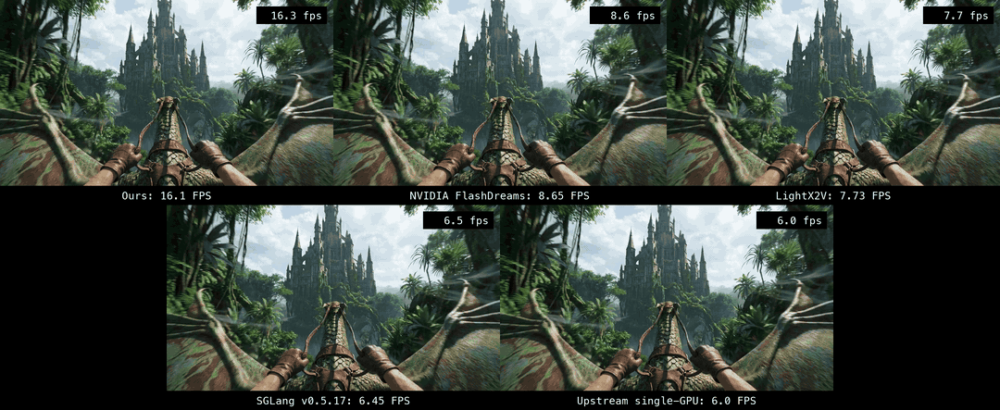

# Other engines — what produced each number

One directory per engine: the scripts, out-of-tree configs and commands that produced the
numbers in the README's engine comparison, kept as the record, not as a supported path. They
were run once, by hand, on a RunPod RTX 5090 (Ubuntu 24.04, driver 570.195, CUDA 12.8) on the
date in the table; the engines move fast and their pins will drift.

| Engine | Directory | Commit benched | Result (1.3B causal_fast, 832×464, 4 steps, chunk 4) |
|---|---|---|---|
| NVIDIA FlashDreams | `flashdreams/` | `c1889e0` (2026-09-17) | 1.87 s/chunk → 8.55 FPS (DiT 1.08 + VAE 0.53 + finalize 0.27), 19.3 GB |
| SGLang realtime pipeline | `sglang/` | `v0.5.17` (2026-09-17) | 2.48 s/chunk → 6.45 FPS at chunk 4 / sink 6 / window 18 (torch SDPA on sm_120, bf16 eager, fp32 VAE); 1.89 s per 12-frame chunk → 6.34 FPS at its default block 3 |
| LightX2V `lingbot_world_fast` runner | `lightx2v/` | `69018c9` (2026-09-17) | 2.07 s/chunk → 7.73 FPS (torch SDPA, its default on sm_120; bf16 DiT and VAE); chunk 4 / sink 6 / window 18 / shift 5 expressed exactly; pose file replayed (resampled over 349 frames) |

Rules: each engine is run as it ships — its default attention backend, precision and decoder on this card
— with only the settings needed to express our metric (chunk 4, sink 6, window 18, 4 steps at shift 5,
Wan VAE, 832×464). None of our kernels or patches are added to another engine. Seeds do not carry
across engines and only LightX2V replays the scene's pose file (FlashDreams keeps a static camera,
SGLang drives its own WASD script), so the clips share a first frame and prompt, not a trajectory.

One clip (ours, dragon scene, seed 42), shown six times at each row's measured steady-state
generation cadence, engine and FPS under each panel. The frames are the same by construction;
only the timing is each engine's (every 16-frame chunk is held for that engine's measured seconds
per chunk). Engines do not reproduce a seed, so this is a timing visualisation, not six renders:
each engine's own output is in `lingbot-world-v2-stream/bench_results/engines/`. Full video:
[engines_grid_same_clip.mp4](https://github.com/kaarelkaarelson/lingbot-world-realtime/releases/download/v0.2.0/engines_grid_same_clip.mp4)
(60 s: `fast` finishes the 22 s of world time at 21 s, upstream at 59 s).

Raw logs, stats JSON and output clips: `lingbot-world-v2-stream/bench_results/engines/`.
The research behind each choice of settings: `lingbot-world-v2-stream/research/engines/`.
